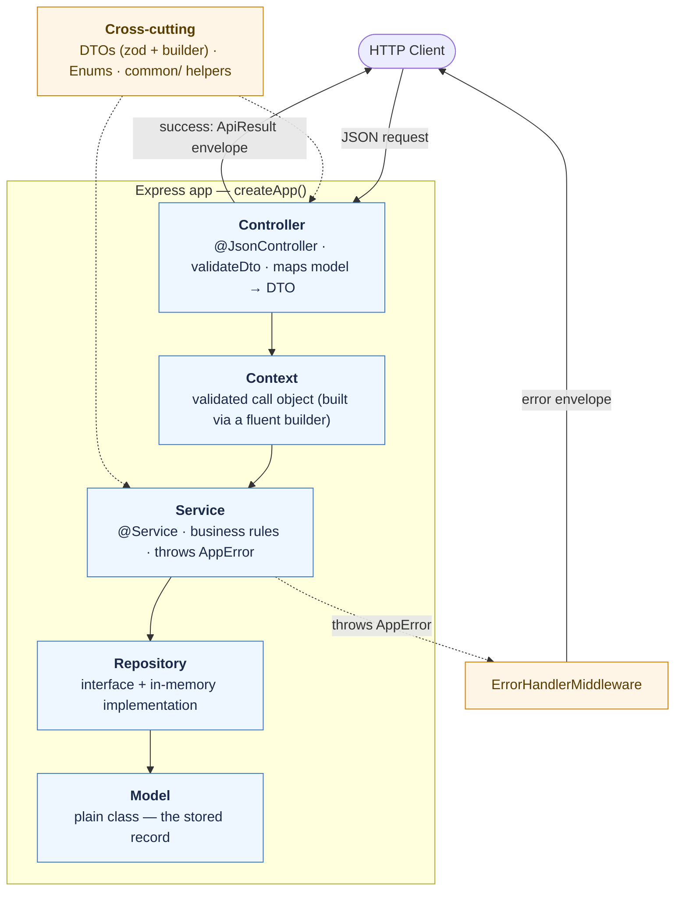
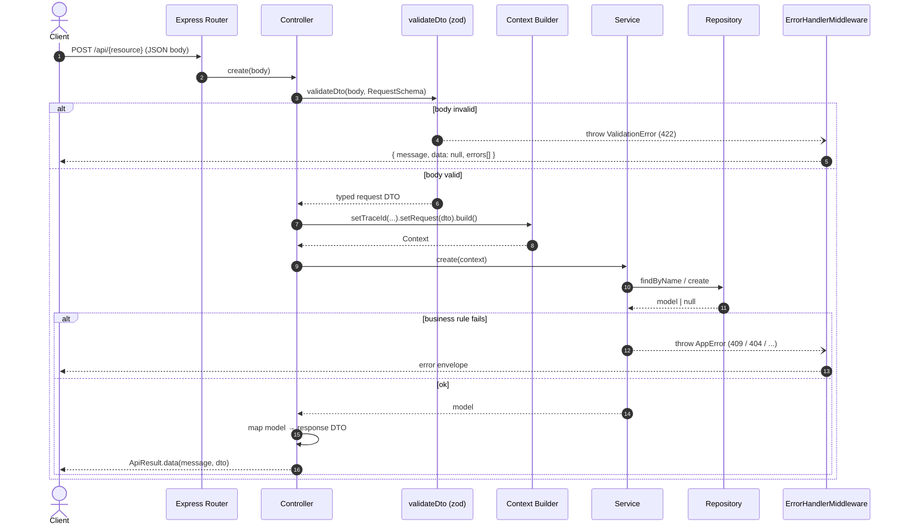
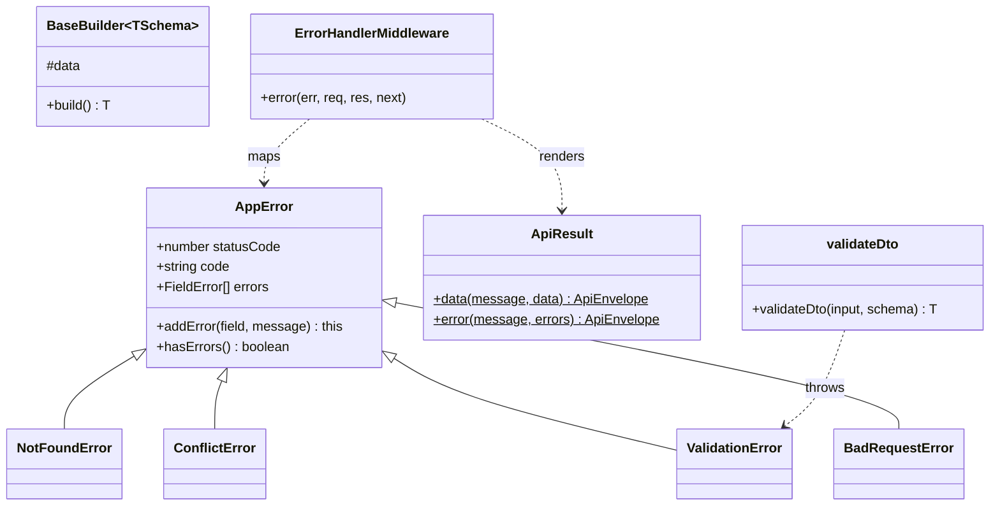
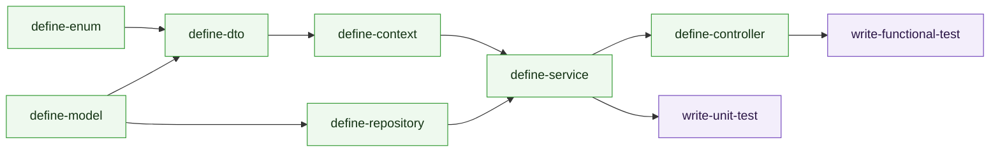

# Sample-Project

A clean, **layered** TypeScript web server built on **Express 5**, with decorator-based routing
(`routing-controllers`), dependency injection (`typedi`), and schema validation (`zod`). State lives in
an **in-memory** store — there is no database. Each layer of the architecture is generated to a fixed
convention by the code-generation skills in `.claude/skills` (see [Code generation](#code-generation)).

---

## Table of contents

- [Tech stack](#tech-stack)
- [Architecture at a glance](#architecture-at-a-glance)
- [The layers](#the-layers)
- [Request lifecycle](#request-lifecycle)
- [Error handling](#error-handling)
- [Response envelope](#response-envelope)
- [The `common/` foundation](#the-common-foundation)
- [Directory structure](#directory-structure)
- [Code generation](#code-generation)
- [Getting started](#getting-started)
- [Conventions](#conventions)

---

## Tech stack

| Concern              | Choice                                     |
| -------------------- | ------------------------------------------ |
| HTTP server          | Express 5                                  |
| Routing              | `routing-controllers` (decorators)         |
| Dependency injection | `typedi` (`@Service` / constructor inject) |
| Validation           | `zod`                                      |
| Persistence          | In-memory hashmap (`Map`) — no DB          |
| Tests                | Vitest (unit) + Supertest (functional)     |
| Language             | TypeScript (strict, decorators enabled)    |

---

## Architecture at a glance

Requests flow **downward** through the layers; each layer depends only on the one beneath it. A request
is validated at the edge, carried inward as a typed **context**, executed by the **service**, and
persisted by the **repository**. The result travels back out as a uniform response envelope. Any error
thrown along the way is caught by a single middleware and rendered consistently.



---

## The layers

| Layer          | Folder              | Responsibility                                                                    | Key rule                                                          |
| -------------- | ------------------- | --------------------------------------------------------------------------------- | ----------------------------------------------------------------- |
| **Controller** | `src/controllers/`  | HTTP surface: validate body, build context, call service, map model → response.   | No business logic; never trusts raw input — always `validateDto`. |
| **Context**    | `src/contexts/`     | A validated, builder-constructed call object (request + metadata like `traceId`). | Built by the controller, consumed by the service.                 |
| **Service**    | `src/services/`     | Orchestration + business rules; returns a **model**.                              | Throws `AppError` subclasses; never formats HTTP.                 |
| **Repository** | `src/repositories/` | Data access over the in-memory store (interface + `InMemory*` impl).              | Returns entities or `null`; never throws business errors.         |
| **Model**      | `src/models/`       | The plain-class shape of a stored record.                                         | No decorators, no logic — data only.                              |
| **DTO**        | `src/dtos/`         | Request/response shapes: a `zod` schema + inferred type + fluent builder.         | Server-owned fields are never on requests.                        |
| **Enum**       | `src/enums/`        | Fixed sets of string constants (statuses, kinds).                                 | String enums; value equals key.                                   |

> The layer folders are currently **empty placeholders** — generate real layers with the skills.

---

## Request lifecycle

A representative `POST` (create) and `GET` (find), end to end. Note the two exit points: the happy path
returns through the controller; any thrown `AppError` short-circuits to the error middleware.



---

## Error handling

Business code never builds an HTTP response by hand. It **throws** a typed `AppError` subclass; a single
`ErrorHandlerMiddleware` (registered in `createApp()`) maps it to the right status code and the uniform
error envelope. Anything that isn't an `AppError` becomes a generic `500`.

| Error class       | HTTP status | `code`        | Throw when…                          |
| ----------------- | ----------- | ------------- | ------------------------------------ |
| `ValidationError` | 422         | `VALIDATION`  | a body/params fail schema validation |
| `BadRequestError` | 400         | `BAD_REQUEST` | the request is malformed/invalid     |
| `NotFoundError`   | 404         | `NOT_FOUND`   | a referenced resource is missing     |
| `ConflictError`   | 409         | `CONFLICT`    | a uniqueness/state conflict          |
| _(any other)_     | 500         | `—`           | unexpected/unhandled failure         |

---

## Response envelope

Every response — success or error — has the same shape, produced by `ApiResult`:

```jsonc
// success
{ "message": "Item created", "data": { "itemId": "…", "name": "Widget" }, "errors": [] }

// error
{ "message": "Validation failed", "data": null, "errors": [ { "field": "name", "message": "Required" } ] }
```

```ts
ApiResult.data(message, data); // success envelope
ApiResult.error(message, errors); // error envelope (used by the middleware)
```

---

## The `common/` foundation

A small, framework-free toolkit every layer reuses — **not** a heavyweight base framework. It holds the
error hierarchy, the response/validation helpers, the DTO builder base, and the error middleware.



- **`errors/`** — `AppError` + the four typed subclasses.
- **`http/ApiResult`** — the `{ message, data, errors }` envelope.
- **`http/validateDto`** — `safeParse` a zod schema; throws `ValidationError` with one entry per bad field.
- **`dto/BaseBuilder`** — minimal fluent builder base; `build()` validates against the schema.
- **`middlewares/ErrorHandlerMiddleware`** — terminal handler that renders every error.

---

## Directory structure

```text
src/
├── index.ts                # createApp() factory (controllers + middlewares) + listen
├── common/                 # minimal shared toolkit — NOT a framework
│   ├── errors/             #   AppError + NotFound/Conflict/Validation/BadRequest
│   ├── http/               #   ApiResult (envelope) + validateDto (zod → ValidationError)
│   ├── dto/                #   BaseBuilder (validates on build())
│   └── middlewares/        #   ErrorHandlerMiddleware
├── controllers/            # HTTP layer        (+ interfaces/)
├── contexts/               # validated call objects + builders
├── services/               # business logic    (+ interfaces/)
├── repositories/           # in-memory data access (+ interfaces/)
├── models/                 # plain entity classes
├── dtos/                   # request/response zod schemas + builders
└── enums/                  # string enums

test/
└── functional/
    └── BaseFunctionalTest.ts   # boots createApp() via Supertest; resets in-memory stores
```

The layer folders ship empty (placeholders) — they fill up as you generate resources.

---

## Code generation

This repo is built to be filled in by **skills** (`.claude/skills/`), one per layer. Generate a resource
in dependency order so each layer exists before the one that imports it:



For a whole feature, work spec-first: `/define-spec` → `/define-plan` → `implement-plan` (which
orchestrates the per-layer skills against the generated plan). See `CLAUDE.md` for the conventions each
skill enforces.

> After generating a resource, two small wires are needed (the controller/repository skills call this out):
> register the new controller in `createApp()`'s `controllers: []`, and clear the new repository's store in
> `BaseFunctionalTest.resetStores()`.

---

## Getting started

```bash
npm install        # install dependencies
npm run dev        # watch-mode dev server (ts-node-dev) on PORT (default 3000)
npm run build      # type-check + compile to dist/
npm start          # run the compiled server (node dist/index.js)
npm test           # vitest run (functional + unit)
npm run test:watch # vitest watch
```

The server mounts everything under the `/api` prefix (`routePrefix` in `createApp()`). With no resources
generated yet, unknown routes return `404`.

---

## Conventions

- **DTOs** = zod schema + inferred type + a `BaseBuilder` subclass. Build DTOs by hand (tests/fixtures)
  via the builder; incoming HTTP bodies are validated with `validateDto`, not built.
- **Server-owned fields** (`<entity>Id`, `status`, `createdAt`) are never accepted on requests — the
  service/repository set them.
- **DI everywhere** — `@Service()` on controllers/services/repositories; constructor injection. The
  container is wired once in `createApp()` via `useContainer(Container)`.
- **Validation only via `validateDto`** in controllers; the framework never validates.
- **Errors are thrown, not formatted** — raise an `AppError` subclass; `ErrorHandlerMiddleware` renders it.
- **Responses are uniform** — always the `{ message, data, errors }` envelope via `ApiResult`.
- **Repositories** clone on read/write and exclude soft-deleted records from default queries.
